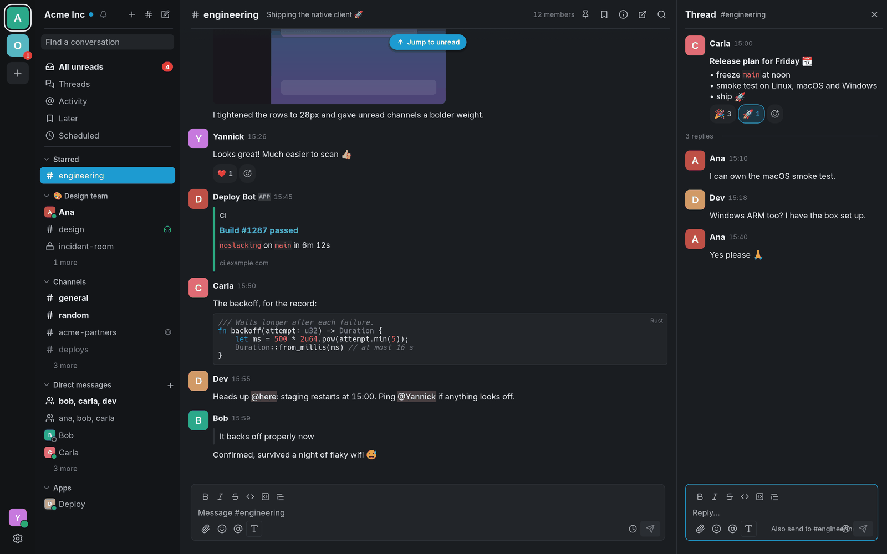
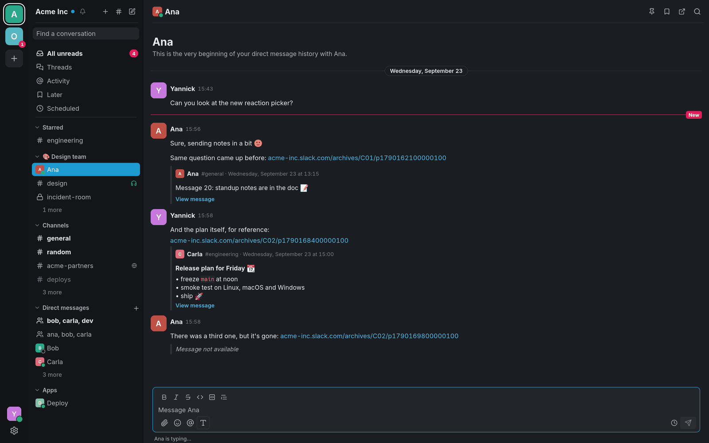
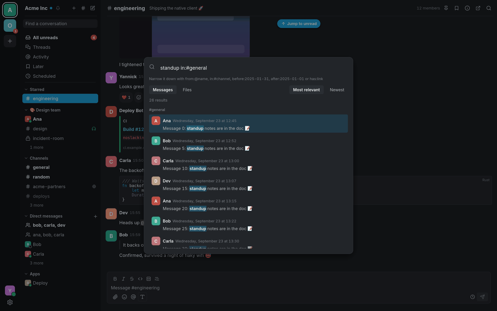

<div align="center">


# NoSlacking

**A fast, native Slack and Microsoft Teams client for Linux, macOS and Windows.**<br>
One small window for all your workspaces. No Electron, no browser engine.

[](https://github.com/Yannicked/NoSlacking/actions/workflows/ci.yml)
[](https://github.com/Yannicked/NoSlacking/releases)
[](LICENSE)

<picture>
  <source media="(prefers-color-scheme: light)" srcset="docs/screenshots/light.png">
  
</picture>

</div>

## Why NoSlacking

- **Native and light.** Written in Rust on [egui](https://github.com/emilk/egui),
  with no browser engine inside: one small program instead of a copy of
  Chrome.
- **Everything you do in Slack every day.** Channels, DMs, threads,
  reactions, files, search, notifications and your sidebar sections, across
  all your workspaces.
- **Teams in the same window.** Your Microsoft Teams chats, channels, calls
  and meetings sit in the workspace rail beside your Slack workspaces.
- **Built for the keyboard.** Ctrl+K to jump anywhere, single keys for the
  selected message, and a sheet of every shortcut on Ctrl+/.
- **Calm by default.** Unread conversations rise to the top of their section;
  quiet ones tuck away behind "N more" until you need them.
- **Your secrets stay put.** Tokens and cookies live only in your operating
  system's keyring, never in a file or the log.
- **Yours to tweak.** Dark and light themes, your own palettes, a compact
  layout, and scripting hooks that run your programs on new messages.

## Features

<table>
<tr>
<td width="50%"></td>
<td width="50%"></td>
</tr>
<tr>
<td align="center">Links to Slack messages show as quotes</td>
<td align="center">Search with Slack's own filters</td>
</tr>
</table>

**Conversations**
- Channels, private channels, direct and group messages, in one workspace
  rail across several workspaces, with your Slack sidebar sections.
- Unread conversations first, quiet ones behind "N more", and closed or
  empty group chats out of the way.
- Start DMs and group DMs with the + on Direct messages; browse, join, leave
  and create channels; channel details, pins and bookmarks you can add and
  edit.

**Messages**
- History that scrolls back smoothly, an unread line, and "jump to unread"
  and "jump to newest".
- Threads in a side panel, with "also send to the channel".
- Reactions with skin tones, your workspace's custom emoji (and adding new
  ones), inline images, file cards, highlighted code blocks and Slack's rich
  text, drawn just as Slack lays it out.
- Links to Slack messages shown as quotes, and app buttons you can press
  (with browser sign-in).
- Mark unread, save for later, share to another conversation, pin, copy a
  link, edit, delete, and delete your own files.

**Huddles** (with browser sign-in)
- Join, start, listen and talk in huddles right in the app, with echo
  cancellation and noise suppression, a call bar showing who is talking,
  and Leave and mute on keyboard shortcuts.
- Watch screen shares and cameras in a call window of its own, turn on
  your camera, and share your screen (through the desktop's own screen
  picker on Wayland).
- Choose the microphone, speaker and camera in Settings → Huddles, or
  switch them mid-call from the arrows beside Mute and Video.
- Huddle invitations as a card and a desktop notification.

**Microsoft Teams** (also in the same window)
- Chats, and your teams' channels as posts with replies, with mentions and
  formatting.
- Calls, and meetings joined by link or ID or started with Meet now, with
  cameras, screen sharing and admitting people from the lobby.
- Reactions, editing and new messages, notifications, read state and
  presence, as for Slack.
- Not yet for Teams: search, files and uploads, pins, bookmarks, Later,
  scheduled messages, your status and Do Not Disturb, custom emoji, and
  browsing or creating channels. Closing a chat hides it here only.
- Add a Teams account (work, school or personal) from the sign-in screen;
  see [Signing in](#microsoft-teams) and
  [Use at your own risk](#use-at-your-own-risk) before using it at work.

**Writing**
- `@mention`, `@group`, `#channel` and `:emoji:` autocomplete, slash
  commands, formatting shortcuts, Shift+Enter for a new line, and spell
  checking.
- Drafts kept across restarts, Send later, and pasting images or files to
  upload them.
- Web addresses you type become links, for everyone reading them.

**Staying in the loop**
- Notifications for DMs, mentions and your own keywords, with mute,
  per-conversation levels and Do Not Disturb; they still arrive when the live
  connection drops.
- Activity, All unreads, Threads, Later and Scheduled views, and search over
  messages and files with `from:`, `in:`, `before:` and `has:`.
- Presence and typing, your status, and "always show as active".

**On your desktop**
- A tray icon that keeps you connected when the window is closed, the unread
  count in the title and launcher, and start at login.
- Themes (dark, light, your own palettes, and Omarchy on Linux) and a compact
  layout.
- Keyboard navigation, screen reader labels, and an English and Dutch
  interface.

## Installing

Every [release](https://github.com/Yannicked/NoSlacking/releases) has:

| System | Download |
|---|---|
| Debian, Ubuntu | `.deb` |
| Fedora, openSUSE | `.rpm` |
| Any Linux | `.flatpak` (install with `flatpak install --user <file>`) or `.tar.gz` |
| macOS | `.zip` with the app |
| Windows | `.zip` with the program |

Then start NoSlacking and sign in.

## Signing in

### Slack

- **Sign in with your browser.** NoSlacking opens Slack's sign-in page in
  your browser. Sign in as usual (password, emailed code or SSO); when Slack
  hands the sign-in back, the browser passes it to NoSlacking, which
  registers itself for `slack://` links when you start this sign-in, and
  only for it: once the link has come, you cancel, 15 minutes pass or you
  quit, it gives them back to whatever had them before, such as the Slack
  app. If your browser does not pass it on, paste the `slack://` link from
  the page instead. Nothing needs to be registered with Slack.
- **Your own Slack app (advanced).** Tucked away at the bottom of the
  sign-in screen: create a free Slack app from the bundled manifest, paste
  its credentials, and sign in. This is the route Slack documents and
  supports, with live Socket Mode updates; a workspace admin may need to
  approve the app.

The manifest is at version 2 (its description says "manifest v2"). Version
2 adds `dnd:read`, `dnd:write`, `usergroups:read` and `bookmarks:write`, for
Do Not Disturb kept in step with Slack, `@group` suggestions and editing
bookmarks. An app made from the first manifest still signs in: if Slack
refuses the newer permissions, NoSlacking asks again for the ones the app
has, and those features stay off for that workspace. Settings → Workspaces
then says what is missing. To update the app, copy the new manifest there,
open your app on [api.slack.com/apps](https://api.slack.com/apps), paste it
under App Manifest and save, reinstall the app when Slack asks, and press
Sign in again.

Browser sign-ins get live messages over Slack's session socket. Tokens and
cookies are stored only in your operating system's keyring (Secret Service on
Linux, the Keychain on macOS, the Credential Manager on Windows), never in a
file, and never written to the log.

### Microsoft Teams

On the sign-in screen (or **+** in the workspace rail), under **Sign in to
Microsoft Teams**:

1. For a work or school account, leave **Organization / Tenant** empty, or
   fill in the company's domain (`company.onmicrosoft.com`) or tenant ID.
   A guest account needs the domain of the company that invited you. For a
   personal Teams (free) account, tick **Personal account**.
2. Press **Sign in with Microsoft Teams**. NoSlacking shows a code: copy it,
   press **Open Microsoft Login**, enter the code on Microsoft's page and
   sign in there as usual. NoSlacking finishes by itself.

NoSlacking signs in as Microsoft's own Teams app, the way other unofficial
Teams clients do. No app needs registering, and your organisation's app
approval does not apply to it, which is also why an administrator may see
the sign-in as unusual or block it (see
[the research note](docs/research/microsoft-teams.md#2-the-route-third-party-clients-take-not-pursued)).
A personal account has chats but no teams or channels. Live messages come
over Teams' own push connection, and the tokens are kept in the keyring,
as Slack's are.

## Building from source

```
cargo build --release
cargo run --release
```

You need a Rust toolchain, the egui build dependencies and, for huddles,
OpenSSL's headers on Linux or Perl on macOS and Windows; see
[`CONTRIBUTING.md`](CONTRIBUTING.md). Video in huddles and calls comes from
a small helper program, `noslacking-video`, that ships beside the app:
`cargo build --release` builds both. It uses the GPU on Linux (VA-API) and
works in software on macOS and Windows. To try the interface without a
Slack account, run the demo:

```
cargo run --features demo
```

## Scripting hooks

NoSlacking can run your own programs on new messages: to speak them aloud,
log them, or light a lamp. Turn them on under **Settings → Scripting hooks**.

<details>
<summary>How hooks run, and the JSON they get</summary>

Hooks work in the spirit of wee-slack's. Each one names a program and what
it runs for: mentions of you, direct messages, or keywords (comma separated,
matched as whole words, ignoring case).

- The program runs directly, never through a shell. Its command line is
  split on spaces; put `"…"` or `'…'` around a part with spaces. There are no
  variables, pipes or globs.
- It gets one JSON object on its standard input and nothing on its command
  line. Its output is ignored.
- It may run for 10 seconds before it is stopped, and at most four hooks run
  at once; a message that arrives while four are running skips them.
- Only failures are logged (the program could not start, failed, or was
  stopped), never the message.
- The JSON never holds a token, a cookie or a file link that would need one.

Only new messages from other people run hooks, not edits, history or your
own messages. A mention of you is checked first, then a direct message, then
the keywords; the first that matches is the `reason`, and a hook runs once
per message.

```json
{
  "version": 1,
  "event": "message",
  "reason": "keyword",
  "keyword": "deploy",
  "workspace": { "id": "T0123", "name": "Acme", "domain": "acme" },
  "conversation": { "id": "C0456", "name": "engineering", "kind": "channel" },
  "message": {
    "ts": "1700000000.000100",
    "thread_ts": null,
    "user": "U0789",
    "author": "Ana",
    "text": "<@U0001> is the deploy done?",
    "plain": "@Yannick is the deploy done?"
  },
  "permalink": "https://acme.slack.com/archives/C0456/p1700000000000100"
}
```

- `reason` is `mention`, `direct` or `keyword`; `keyword` is only there for
  `keyword`, and names the one that matched.
- `conversation.kind` is `channel`, `private`, `direct` or `group`.
- `message.text` is Slack's own markup; `message.plain` is the same text with
  people and channels by name. `thread_ts` is the thread's parent for a reply,
  else `null`. `user` is `null` for some apps.
- `permalink` opens the message in Slack, or is `null` when there is none.
- `version` goes up only when the shape changes in a way a script would
  notice; new fields may appear at any time.

</details>

## Files

NoSlacking keeps settings and themes in your config directory, logs and read
state in your state directory, and the image cache in your cache directory.
Open them from **Settings → Files**.

## Use at your own risk

NoSlacking is an independent, unofficial client. It is not made, endorsed,
supported or reviewed by Slack Technologies, Salesforce or Microsoft.
"Slack" is a trademark of Salesforce, Inc., and "Microsoft Teams" a
trademark of Microsoft Corporation, used here only to say which services
this client works with.

Before you use it, know that:

- **Browser sign-in is unsupported.** It uses endpoints that Slack does
  not document. Slack can change or
  remove them at any time, and NoSlacking may stop working without warning.
- **It may break your workspace's rules or Slack's terms.** Slack's terms
  limit third-party clients, and your workspace may only allow approved
  apps. Slack or a workspace admin may sign out or suspend an account that
  uses an unofficial client. Check with your workspace's admins if you are
  unsure, and do not use it where it is not allowed.
- **Your session is as powerful as your password.** The `d` cookie and the
  session tokens give full access to your account. NoSlacking keeps them in
  the OS keyring and sends them only to Slack's own hosts, but treat them
  like a password and sign out (or revoke the session in Slack) on a
  computer you stop using.
- **Teams sign-in goes around your organisation's app controls.** It signs
  in as Microsoft's own Teams app, on endpoints Microsoft does not document
  for others. Administrators may see it as an unusual sign-in, Conditional
  Access may block it, and Microsoft's API terms forbid getting around
  technical limits. Do not use it at work without your administrators'
  agreement.
- **There is no warranty.** The software is provided as is; see the
  [license](LICENSE).

Use NoSlacking only with your own accounts, and use your own Slack app (the
documented route) where your workspace requires it.

## Thanks

NoSlacking is built on [egui](https://github.com/emilk/egui) and the
[fastframe](https://github.com/crmne/fastframe) crates, the same foundation
as [ZapFast](https://github.com/crmne/zapfast) and
[Spotifast](https://github.com/crmne/spotifast).

NoSlacking owes its approach to two other unofficial clients:

- [Make Slack Great Again](https://github.com/punarinta/make-slack-great-again)
  (msga), which inspired session sign-in and signing in through the browser
  by catching Slack's hand-off.
- [wee-slack](https://github.com/wee-slack/wee-slack), which has reused the
  browser session for years.

## License

MIT; see [`LICENSE`](LICENSE).
