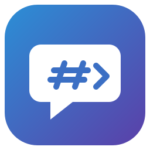

# NoSlacking

A native [Slack](https://slack.com) client for Linux, macOS and Windows,
written in Rust. It is small, fast and quiet: one window, your channels and
DMs, threads, reactions, files and emoji, with no Electron.

It is built on [egui](https://github.com/emilk/egui) and the
[fastframe](https://github.com/crmne/fastframe) crates, the same foundation as
[ZapFast](https://github.com/crmne/zapfast) and
[Spotifast](https://github.com/crmne/spotifast).

## What it does

- **Workspaces:** channels, private channels, direct messages and group DMs,
  in one workspace rail across several workspaces, with your Slack sidebar
  sections.
- **Messages:** history that scrolls back, day separators, an unread line,
  and "jump to unread" and "jump to newest".
- **Threads:** a side panel, with "also send to the channel".
- **Search:** messages and files, with Slack's `from:`, `in:`, `before:`
  and `has:` filters, and jumping to a result in context.
- **Conversations:** start direct and group messages; browse, join, leave
  and create channels; channel details, pins and bookmarks.
- **Composer:** `@mention`, `#channel` and `:emoji:` autocomplete, slash
  commands, formatting shortcuts, drafts kept across restarts, and
  uploading pasted images and dropped files.
- **Rendering:** reactions with skin tones, your workspace's custom emoji,
  inline images, file cards, highlighted code blocks, and Slack's markup.
- **Notifications:** for DMs, mentions and your own keywords, with mute,
  per-conversation levels and Do Not Disturb.
- **Desktop:** the unread count in the title and launcher, a tray icon,
  start at login, themes (dark, light, your own palettes, and Omarchy on
  Linux), and a Ctrl+K quick switcher.
- **Accessibility:** keyboard navigation of messages, screen reader labels,
  and an English and Dutch interface.

## Signing in

Three ways, chosen on the sign-in screen. The first two reuse your own
Slack session; neither needs anything registered.

- **Sign in with your browser.** NoSlacking opens Slack's sign-in page in
  your browser. Sign in as usual (password, emailed code or SSO); when Slack
  hands the sign-in back, the browser passes it to NoSlacking, which
  registers itself for `slack://` links for this. If your browser does not
  pass it on, paste the `slack://` link from the page instead.
- **Paste your session cookie.** Paste your workspace address and the `d`
  cookie from a browser where you are logged in to Slack. The sign-in page
  explains where to find it.
- **Your own Slack app (advanced).** Create a free Slack app from the bundled
  manifest, paste its credentials, and sign in. This is the route Slack
  documents and supports, with live Socket Mode updates; a workspace admin
  may need to approve the app.

Session sign-ins get live messages over Slack's session socket. Tokens and
cookies are stored only in your operating system's keyring (Secret Service on
Linux, the Keychain on macOS, the Credential Manager on Windows), never in a
file, and never written to the log.

## Building

```
cargo run
```

You need a Rust toolchain and the egui build dependencies; see
[`CONTRIBUTING.md`](CONTRIBUTING.md). To try the interface without a Slack
account:

```
cargo run --features demo
```

## Scripting hooks

In the spirit of wee-slack's hooks, NoSlacking can run your own programs on
new messages: to speak them aloud, log them, or light a lamp. Hooks are off
until you turn them on under **Settings → Scripting hooks**, where each hook
names a program and what it runs for: mentions of you, direct messages, or
keywords (comma separated, matched as whole words, ignoring case).

- The program runs directly, never through a shell. Its command line is
  split on spaces; put `"…"` or `'…'` around a part with spaces. There are no
  variables, pipes or globs.
- It gets one JSON object on its standard input and nothing on its command
  line. Its output is ignored.
- It may run for 10 seconds before it is stopped, and at most four hooks run
  at once; a message that arrives while four are running skips them.
- Only failures are logged (the program could not start, failed, or was
  stopped), never the message.
- The JSON never holds a token, a cookie or a file link that would need one.

Only new messages from other people run hooks, not edits, history or your
own messages. A mention of you is checked first, then a direct message, then
the keywords; the first that matches is the `reason`, and a hook runs once
per message.

```json
{
  "version": 1,
  "event": "message",
  "reason": "keyword",
  "keyword": "deploy",
  "workspace": { "id": "T0123", "name": "Acme", "domain": "acme" },
  "conversation": { "id": "C0456", "name": "engineering", "kind": "channel" },
  "message": {
    "ts": "1700000000.000100",
    "thread_ts": null,
    "user": "U0789",
    "author": "Ana",
    "text": "<@U0001> is the deploy done?",
    "plain": "@Yannick is the deploy done?"
  },
  "permalink": "https://acme.slack.com/archives/C0456/p1700000000000100"
}
```

- `reason` is `mention`, `direct` or `keyword`; `keyword` is only there for
  `keyword`, and names the one that matched.
- `conversation.kind` is `channel`, `private`, `direct` or `group`.
- `message.text` is Slack's own markup; `message.plain` is the same text with
  people and channels by name. `thread_ts` is the thread's parent for a reply,
  else `null`. `user` is `null` for some apps.
- `permalink` opens the message in Slack, or is `null` when there is none.
- `version` goes up only when the shape changes in a way a script would
  notice; new fields may appear at any time.

## Files

NoSlacking keeps settings and themes in your config directory, logs and read
state in your state directory, and the image cache in your cache directory.
Open them from **Settings → Files**.

## Use at your own risk

NoSlacking is an independent, unofficial client. It is not made, endorsed,
supported or reviewed by Slack Technologies or Salesforce. "Slack" is a
trademark of Salesforce, Inc., used here only to say which service this
client works with.

Before you use it, know that:

- **Session sign-in is unsupported.** Both browser sign-in and the pasted
  cookie use endpoints that Slack does not document. Slack can change or
  remove them at any time, and NoSlacking may stop working without warning.
- **It may break your workspace's rules or Slack's terms.** Slack's terms
  limit third-party clients, and your workspace may only allow approved
  apps. Slack or a workspace admin may sign out or suspend an account that
  uses an unofficial client. Check with your workspace's admins if you are
  unsure, and do not use it where it is not allowed.
- **Your session is as powerful as your password.** The `d` cookie and the
  session tokens give full access to your account. NoSlacking keeps them in
  the OS keyring and sends them only to Slack's own hosts, but treat them
  like a password and sign out (or revoke the session in Slack) on a
  computer you stop using.
- **There is no warranty.** The software is provided as is; see the
  [license](LICENSE).

Use NoSlacking only with your own account, and use your own Slack app (the
documented route) where your workspace requires it.

## Thanks

NoSlacking owes its approach to two other unofficial clients:

- [Make Slack Great Again](https://github.com/punarinta/make-slack-great-again)
  (msga), which inspired session sign-in and signing in through the browser
  by catching Slack's hand-off.
- [wee-slack](https://github.com/wee-slack/wee-slack), which has reused the
  browser session for years.

## License

MIT; see [`LICENSE`](LICENSE).
